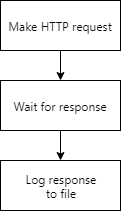
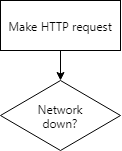
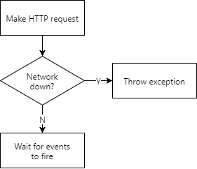
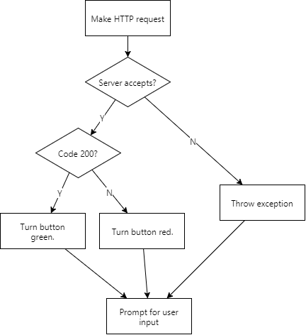
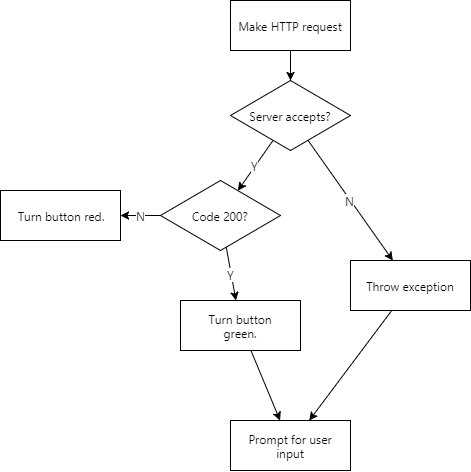
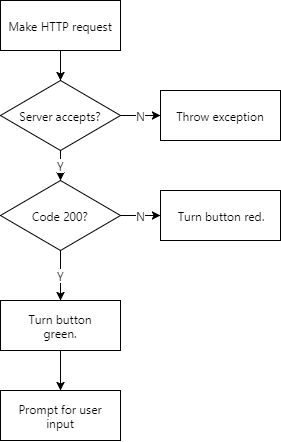

## Step

Each step is a Line item.

* Make HTTP request.
* Wait for response.
* Log response to file.

## Decisions

Also line items. Must end with a question mark.

* Make HTTP request.
* Network down?

### Quick exits

Put quick exits inline, prefixed with "then" or "if so." Use the prefix "Otherwise, " for the next step.

* Make HTTP request.
* Network down? If so, throw exception.
* Otherwise, wait for events to fire.

These are used when you only have an additional step in the branch.

### Nested decisions

Otherwise, if there are many steps in the decision, use nested list items for both true and false branches.

* Make HTTP request.
* Server accepts?
  * If code 200? Turn button green. (Continues at prompt...)
  * Otherwise, turn button red. (Continues at prompt...)
* Otherwise, throw exception.
* Prompt for user input.

### Ending branches

Exclamation points end the line.

* Make HTTP request.
* Server accepts response?
  * Code 200? If so, turn button green. (Continues at prompt...)
  * Otherwise, turn button red! (Ends flow.)
* Otherwise, throw exception.
* Prompt for user input.

* Make HTTP request.
* Server accepts response?
  * Code 200? If so, turn button green. (Continues at prompt...)
  * Otherwise, turn button red! (Ends flow.)
* Otherwise, throw exception!
* Prompt for user input.

Which can be rewritten as:

* Make HTTP request.
* Server accepts response? If not, throw exception!
* Code 200? If not, turn button red!
* Turn button green.
* Prompt for user input.

## Wording

* Condition? / Is condition? / If condition?
  * Do A.
  * If so, then do A.
  * If not, then do A.
  * Then do A.
  * If true, then do A., 
  * Do A! / Do A. End.

---

* Make HTTP request.
* Server rejects response? Throw exception. End.
* Otherwise, code non-200? Turn button red. End.
* Turn button green.
* Prompt for user input.